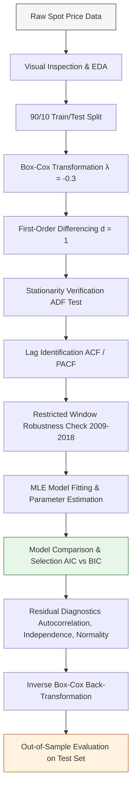
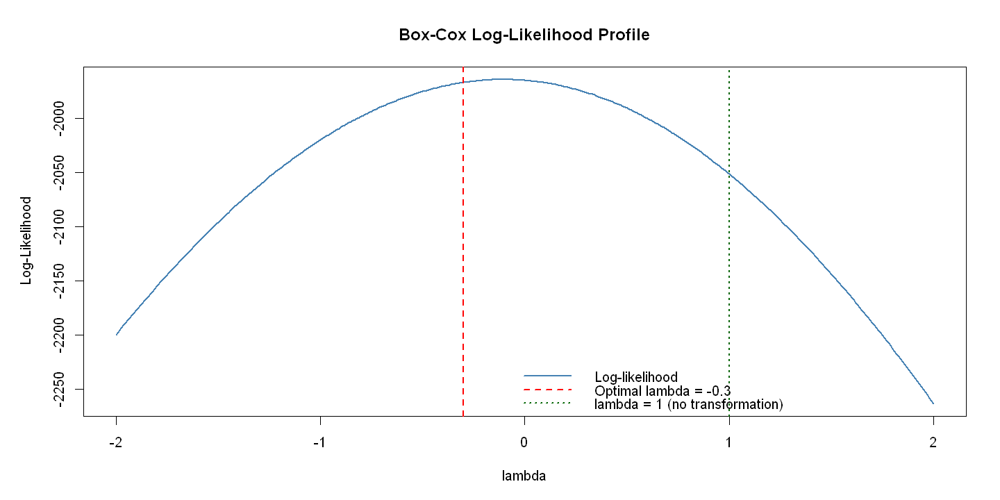
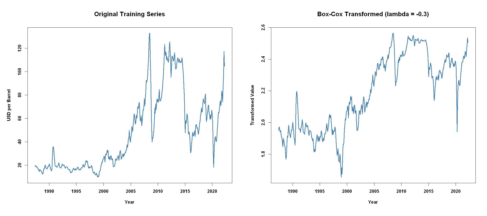
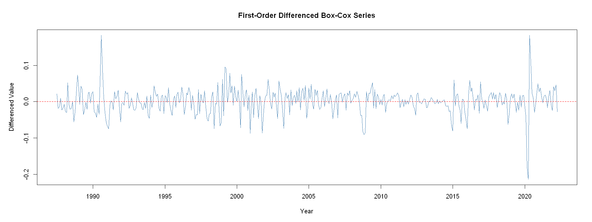
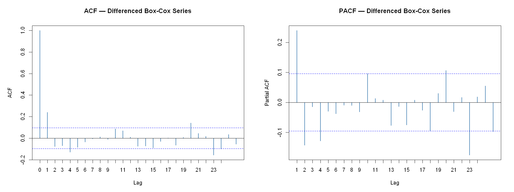
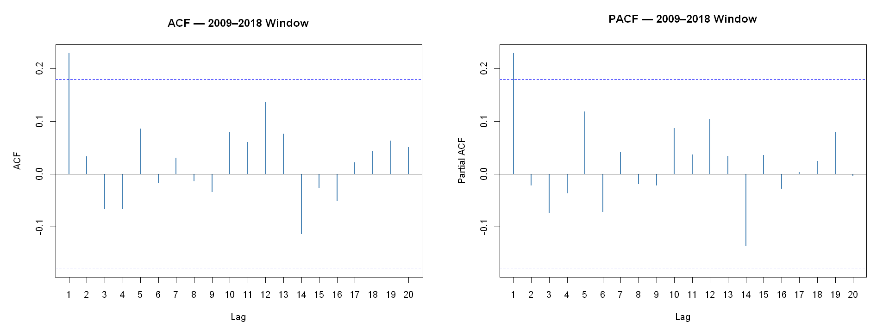
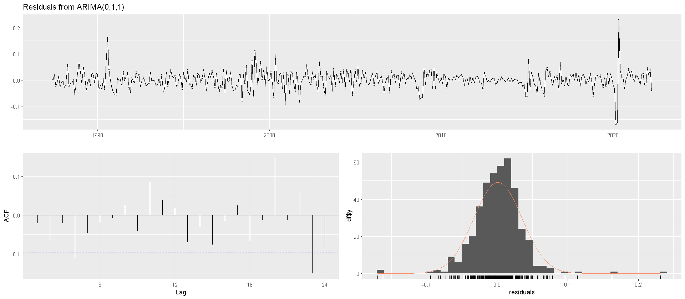
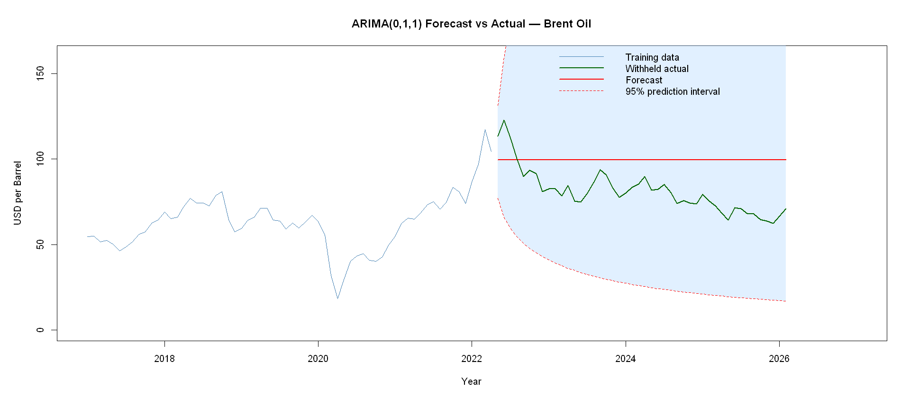

# Time Series Analysis and Forecasting of Brent Crude Oil Spot Prices

An academic research project implementing the Box-Jenkins methodology to model and forecast monthly Brent Crude Oil spot prices (June 1987 to February 2026).

---

## Executive Summary

This repository contains the dataset, R Jupyter notebook, and LaTeX report source files for analyzing and forecasting monthly Brent Crude Oil spot prices. The project utilizes a dataset of 465 monthly observations from the Federal Reserve Economic Data (FRED). 

To model the highly volatile series, we employ a Box-Jenkins Autoregressive Integrated Moving Average (ARIMA) framework. The variance is stabilized using a Box-Cox transformation ($\lambda = -0.3$), and stationarity is achieved via first-order differencing ($d = 1$). We compare five candidate models using information criteria (AIC and BIC) and select **ARIMA(0,1,1)** based on the Principle of Parsimony. Model adequacy is verified through Ljung-Box, Runs, and Shapiro-Wilk tests. Finally, out-of-sample forecasts are generated for a withheld 10% test set (May 2022 to February 2026) and evaluated using RMSE, MAE, and MAPE metrics.

---

## Modeling Pipeline and Methodology

The project follows a structured statistical time series modeling workflow:



---

## Detailed Pipeline Implementation

### 1. Data Preparation and Train/Test Split
The dataset is loaded and checked for gaps. We split the series into training (90%) and testing (10%) sets to validate the model's predictive capabilities on a volatile out-of-sample window that captures the price correction following the 2022 Russia-Ukraine war shock.

```R
# Convert raw data to monthly time series object
oil_ts <- ts(oil_raw$DCOILBRENTEU, start = c(1987, 6), frequency = 12)

# 90/10 split
n_total <- length(oil_ts)       # 465 observations
n_test  <- round(n_total * 0.1) # 46 observations (May 2022 - Feb 2026)
n_train <- n_total - n_test     # 419 observations (June 1987 - Apr 2022)

train_ts <- head(oil_ts, n_train)
test_ts  <- tail(oil_ts, n_test)
```

### 2. Variance Stabilization
Visual inspection reveals that price volatility increases with the price level (heteroscedasticity). We apply a Box-Cox transformation to stabilize the variance:

$$T(Y_t) = \frac{Y_t^\lambda - 1}{\lambda}$$

```R
# Search for optimal lambda parameter on training set
lambda_result <- BoxCox.lambda(train_ts, method = "loglik", lower = -2, upper = 2)
# Optimal lambda: -0.3
train_bc <- BoxCox(train_ts, lambda = lambda_result)
```

The log-likelihood profile and the resulting variance-stabilized series are shown below:

<p align="center">
  
  
</p>

### 3. Stationarity Testing and Differencing
The transformed training series ($Z_t$) is checked for stationarity using the Augmented Dickey-Fuller (ADF) test:
* **ADF on $Z_t$:** statistic = -2.4529, lag order = 7, $p$-value = 0.3861 (Fail to reject unit root; series is non-stationary).

To achieve stationarity, we apply first-order differencing:
$$W_t = \Delta Z_t = Z_t - Z_{t-1}$$

* **ADF on $W_t$:** statistic = -8.0772, lag order = 7, $p$-value $\le$ 0.01 (Reject unit root; series is stationary).
This confirms the integration order is **$d = 1$**.

<p align="center">
  
</p>

### 4. Lag Identification (ACF & PACF Analysis)
The Autocorrelation Function (ACF) and Partial Autocorrelation Function (PACF) are computed on the stationary series $W_t$ to identify appropriate autoregressive ($p$) and moving average ($q$) lag orders.

<p align="center">
  
</p>

* **ACF:** Cuts off after lag 1, indicating a Moving Average process of order 1 ($q = 1$).
* **PACF:** Significant spikes at lags 1 and 2, tailing off gradually, indicating an Autoregressive process.

Based on these results, we specify five candidate models within the ARIMA($p, 1, q$) family:
1. **ARIMA(0,1,1):** Pure MA(1) process.
2. **ARIMA(1,1,0):** Pure AR(1) process.
3. **ARIMA(2,1,0):** Pure AR(2) process.
4. **ARIMA(1,1,1):** Mixed ARMA(1,1) process.
5. **ARIMA(2,1,1):** Mixed ARMA(2,1) process.

### 5. Restricted Window Robustness Check (2009--2018)
To verify that our identified lag structure is stable and not distorted by the major financial crises of 2008 and 2020, we repeated the stationarity and autocorrelation identification on a stable restricted window (January 2009 to December 2018).

<p align="center">
  
</p>

The analysis of the restricted window shows a clean lag-1 structure, confirming that the higher-order lag crossings in the full series are noise from global economic shocks and verifying our low-order candidate models.

### 6. Model Fitting and Comparison
Each candidate model is fitted using Maximum Likelihood Estimation (MLE) on the Box-Cox transformed training series.

| Model | AIC | BIC | Parameters | Selection Decision |
| :--- | :---: | :---: | :---: | :---: |
| **ARIMA(0,1,1)** | -1632.49 | **-1624.42** | 1 | Selected (BIC Winner, Parsimonious) |
| ARIMA(1,1,0) | -1625.79 | -1617.71 | 1 | Rejected |
| ARIMA(2,1,0) | -1632.46 | -1620.36 | 2 | Rejected |
| ARIMA(1,1,1) | -1632.58 | -1620.48 | 2 | Rejected |
| **ARIMA(2,1,1)** | **-1633.72** | -1617.58 | 3 | Rejected (AIC Winner, complex) |

By the **Principle of Parsimony**, we select **ARIMA(0,1,1)** as the final model because it is simpler, supported by the BIC, and performs similarly to the more complex ARIMA(2,1,1).

The fitted ARIMA(0,1,1) model equation is:
$$(1-B)Z_t = (1 + 0.3026B)\varepsilon_t$$
where the $ma_1$ coefficient is **$0.3026$** (Standard Error = $0.0505$, $t$-statistic = $5.987$).

---

## Model Verification & Diagnostics

We conduct residual diagnostic checks on the selected ARIMA(0,1,1) model to ensure the residuals behave like white noise:

<p align="center">
  
</p>

### Statistical Diagnostic Tests

* **Ljung-Box Test (Uncorrelation):** Checked at lag 20 to test overall autocorrelation.
  * $H_0$: Residuals are uncorrelated.
  * Result: $\chi^2 = 30.5534$, $p$-value = 0.0614. We fail to reject $H_0$. Residuals are uncorrelated.
* **Runs Test (Independence):** Checked for sign changes.
  * $H_0$: Residuals are independent.
  * Result: $p$-value = 0.4110. We fail to reject $H_0$. Residuals are independent.
* **Shapiro-Wilk Test (Normality):** Tested on standardized residuals.
  * $H_0$: Residuals are normally distributed.
  * Result: $W = 0.9195$, $p$-value $\approx$ 0. We reject $H_0$. Residuals are non-normal.

### Diagnostic Summary
While the residuals satisfy independence and uncorrelation conditions, they fail the normality assumption. The histograms and Q-Q plots reveal heavy tails. This non-normality is driven by the extreme structural shocks in 1991 and 2020. Because the normality assumption is violated, the model is not strictly adequate under classical Box-Jenkins assumptions. This is a common limitation of linear time series models applied to long economic commodity series.

---

## Out-of-Sample Forecasting & Performance

Using the fitted ARIMA(0,1,1) model, we generate a 46-step-ahead forecast for the test period (May 2022 to February 2026). Predictions are back-transformed from the Box-Cox scale back to the original USD scale using the inverse transformation:

$$Y_{t+h} = \left( -0.3 \hat{Z}_{t+h|t} + 1 \right)^{-1/0.3}$$

<p align="center">
  
</p>

### Forecast Accuracy Metrics

* **Mean Error (ME):** -18.56 USD (indicates systematic over-forecasting during the post-2022 price correction)
* **Root Mean Squared Error (RMSE):** 22.50 USD
* **Mean Absolute Error (MAE):** 20.74 USD
* **Mean Absolute Percentage Error (MAPE):** 27.49%
* **95% Prediction Interval Coverage:** **100% (46 / 46 observations)**

### Policy Discussion & Limitations
Because the model has no Autoregressive component ($p = 0$) and a single order of integration ($d = 1$), the long-term forecast path reverts to a constant level (**\$99.57 per barrel**). It fails to predict the post-2022 commodity price correction down to \$70.89. 

For oil-dependent nations like Algeria, relying strictly on static linear ARIMA models for national budget planning could lead to systematic revenue overestimation during market corrections. To address these limitations, extensions such as **GARCH** models (to capture volatility clustering), **Regime-Switching** models, or hybrid machine learning frameworks (**ARIMA-LSTM**) should be explored.

---

## Repository Structure

```
├── DCOILBRENTEU.csv                        # Raw monthly spot price dataset (FRED)
├── Individual_project_Afaf_Khadraoui_G10.ipynb # R Jupyter Notebook containing full analysis
├── report.tex                              # LaTeX report source file
├── ensia_logo.png                          # Institutional logo for the report cover page
├── README.md                               # Project documentation (this file)
└── images/                                 # Extracted plots from the analysis
    ├── plot_cell_10_1.png                  # Raw spot price series plot
    ├── plot_cell_16_2.png                  # Box-Cox log-likelihood profile
    ├── plot_cell_18_3.png                  # Transformed training series plot
    ├── plot_cell_23_4.png                  # First-order differenced series plot
    ├── plot_cell_27_5.png                  # ACF & PACF of differenced series
    ├── plot_cell_29_6.png                  # BIC subset regression plot
    ├── plot_cell_29_7.png                  # AIC subset regression plot
    ├── plot_cell_32_8.png                  # Restricted window differenced plot (2009-2018)
    ├── plot_cell_34_9.png                  # ACF & PACF of restricted window
    ├── plot_cell_44_10.png                 # Standardized residuals of candidate models
    ├── plot_cell_46_11.png                 # ACF of residuals
    ├── plot_cell_50_12.png                 # QQ plots & histograms of residuals
    ├── plot_cell_56_13.png                 # checkresiduals() diagnostic dashboard
    └── plot_cell_66_14.png                 # Out-of-sample forecast vs. actual plot
```

---

## Replication and Setup

### 1. R Notebook Setup
To execute the R Jupyter notebook `Individual_project_Afaf_Khadraoui_G10.ipynb`, ensure you have R installed along with the required libraries:

```R
install.packages(c("tseries", "forecast", "MASS", "ggplot2", "readr", "dplyr", "TSA"))
```


---

## Academic Context
* **Author:** Khadraoui Afaf 
* **Institution:** National School of Artificial Intelligence (ENSIA), Sidi Abdellah, Algiers, Algeria
* **Course:** Time Series Analysis and Classification (TSAC 2025/2026)
